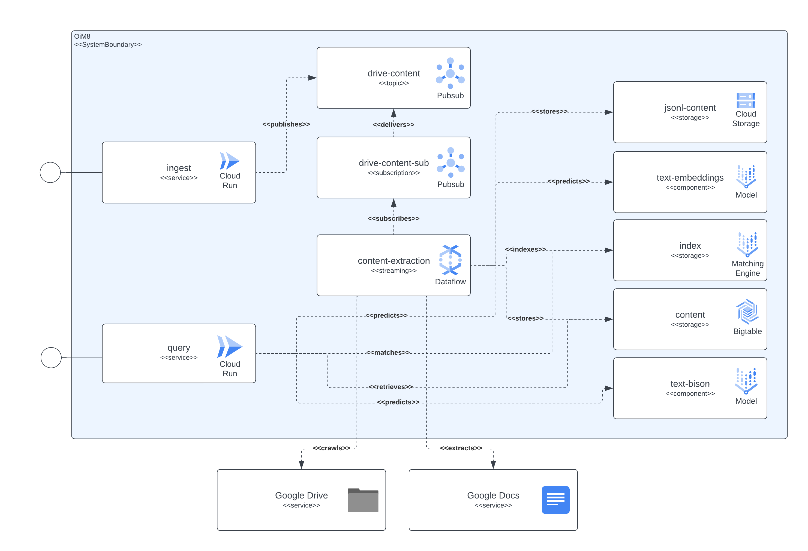

# Content Discovery Platform - GenAI

This repository contains the code and automation needed to build a simple content discovery platform powered by VertexAI fundational models. This platform should be capable of capturing documents content (initially Google Docs), and with that content generate embeddings vectors to be stored in a vector database powered by VertexAI Matching Engine, later this embeddings can be utilized to contextualize an external consumer general question and with that context request an answer to a VertexAI fundational model to get an answer. 

## Platform Components

The platform can be separated in 4 main components, access service layer, content capture pipeline, content storage and LLMs. The services layer enable external consumers to send document ingestion requests and later on send inquiries about the content included in the previously ingested documents. The content capture pipeline is in charge of capturing the document's content in NRT, extract embeddings and map those embedding with real content that can later on be used to contextualize the external users questions to a LLM. The content storage is separated in 3 differnt purposes, LLM fine tuning, online embeddings matching and chunked content, each of them handled by a specialized storage system and with the general pupose of storing the information needed by the platform's components to implement the ingestion and query uses cases. Last but not least the platform makes use of 2 specialized LLMs to create real time embeddings from the ingestied document content and another one in charge of generating the answers requested by the platform's users.

## GCP Technologies

All the componente s described before are implemented using publicly available GCP services. To enumerate them: Cloud Build, Cloud Run, Cloud Dataflow, Cloud Pubsub, Cloud Storage, Cloud Bigtable, Vertex AI Matching Engine, Vertex AI Fundational models (embeddings and text-bison), alongside with Google Docs and Google Drive as the content infromation sources.

## Architecture

The next image shows how the different components of the architecture and technologies interact betweeen each other.



## Deployment Automation

This platform uses Terraform for the setup of all its components. For those that currently does not have native support we have created null_resource wrappers, this are good workarounds but they tend to have very rough edges so be aware of potential errors.

The complete deployment as of today (June 2023) can take up to 90 mintues to complete, the biggest culprit being the Matching Engine related components that take the majority of that time to be created and readily available. With time this extended runtimes will only improve. 

## First setup 

The setup should be executable from the scripts included in the repository. 

### Requirements

There are a few requirements needed to be fulfilled to deploy this platform being those: 

* A gcloud installation
* A services account or user configured in gcloud with enough permissions to create the needed resources 
* A python 3.11 installation
* A Java 17 installation
* A Terraform 0.12+ installation

### Triggering a deployment 

In order to have all the components deployed in GCP we need to build, create infrastructure and later on deploy the services and pipelines. 

To achieve this we included the script `start.sh` which basically orchestrate the other included scripts to accomplish the full deployment goal. 

Also we have included a `cleanup.sh` script in charge of destroying the infrastructure and clean up the collected data. 

## Exposed Services

The solution exposes a couple of resources through GCP CloudRun, which can be used to interact for content ingestion and content discovery queries. 

### Content Ingestion

This service is capable of ingesting data from documents hosted in Google Drive or self contained multi-part requests which contain a document identifier and the document's content encoded as binary. 

#### Google Drive Content Ingestion

The Google Drive ingestion is done by sending a HTTP request simielar to the next example 
```bash
 curl -X POST -H "Content-Type: application/json" \
    -H "Authorization: Bearer $(gcloud auth print-identity-token)" \
    https://<service-address>/ingest/content/gdrive \
    -d $'{"url":"https://docs.google.com/document/d/somevalid-googledocid"}'
```
This request will indicate the platform to grab the document from the provided `url` and in case the service account that runs the ingestion has access permissions to the document, it will extract the content from it and store the information for indexing, later discovery and retrieval.

The request can contain the url of a Google document or a Google Drive folder, in the last case the ingestion will crawl the folder for documents to process. Also, is possible to use the property `urls` which expect a `JSONArray` of `string` values, each of them a valid Google Document url.

#### Multipart Content Ingestion

In the case of wanting to include the content of an article, document, or page that is locally accessible by the ingest client, using the multipart endpoint should be sufficient to ingest the document. See the next `curl` command as an example, the service expects that the `documentId` form field is set to identify and univocally index the content:
```bash 
curl -H "Authorization: Bearer $(gcloud auth print-identity-token)" \
  -F documentId=<somedocid> \
  -F documentContent=@</some/local/directory/file/to/upload \
  https://<service-address>/ingest/content/multipart
```